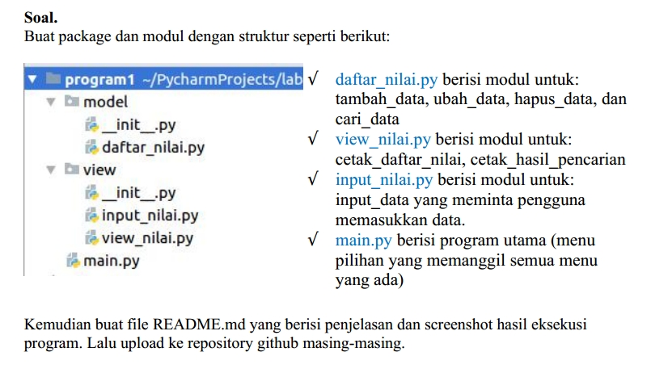

# 13_UAS_package dan modul daftar nilai

BAHASA PEMROGRAMAN

TEHNIK INFORMATIKA

UNIVERSITAS PELITA BANGSA

NAMA : GUNAWAN

NIM     : 312010191

KELAS   : TI.20.B1

DOSEN   : Agung Nugroho,S.Kom.,M.Kom

SOAL UJIAN AKHIR SEMESTER (UAS)

**Buat package dan modul dengan struktur**

- Untuk membuat Package Modul kita buka aplikasi **PyCharm** :

- Pilih `New Project` Lalu simpan project sesuai Location Directory dan beri nama folder :

- Kemudian Pilih New > Python Package :

       " -> Kita buat Nama Model dan View "

- Tampilan Package folder Model dan View yang terdapat file_init_.py

- Kemudian kita buat nama program Python dengan Klik Folder Model > pilih New >Python File dengan nama : daftar_nilai.py

- Lalu kita buat nama program Python dengan Klik Folder view > pilih New >Python File dengan nama : input_nilai.py dan view_nilai.py

- Nama program python sudah kita buat :

# **Buat syntax program python**

**Membuat code program : `daftar_nilai.py`**

**Penjelasan :**
- Disini kita menggunakan dictionary ya untuk menyimpan inputan data mahasiswa 
- Def tambahkan : Dibagian ini kita gunakan print untuk penulisan bagian input data mahasiswa nanti agar terlihat rapih 
- Def hapus :  
- Disini kita buat inputan yang menginput nama 
    - Gunanya untuk menghapus data mahasiswa dari nama mahasiswa itu sendiri 
    - Kita gunakan del untuk fungsi menghapus datanya 
    - (If)Jika mahasiswa tersebut ada maka data mahasiswa tersebut akan terhapus 
    - (Else)Jika nama mahasiswa tersebut tidak ada maka datanya tidak akan ditemukan 
- Def ubah 
Penjelasan: 
    - Disini kita hampir sama dengan yang hapus, kita gunakan inputan nama untuk mengubah NIM, Nilai Tugas, Ujian Tengah Semester(UTS), ataupun Ujian Akhir Semester(UAS) 
    - Lalu setelah kita memasukkan nama maka dictionary akan mengeksekusi program menggunakan keys untuk mencari data dari nama mahasiswa tersebut 
    - (If)Jika nama mahasiswa tersebut ketemu atau ada didalam data maka program akan masuk ke inputan NIM, Nilai Tugas, Nilai UTS, dan Nilai UAS yang baru 
    - (Else)Jika nama mahasiswa tersebut tidak ada didalam data maka program akan memunculkan tulisan atau perintah bahwa data mahasiswa tidak ada 
- Def cari 
Penjelasan: 
    - Fungsinya sama dengan Def tambahkan     

**Membuat code program `input_nilai.py`**

Penjelasan: 
- From dan import 
Penjelasan: 
    - From digunakan untuk memanggil package sementara import untuk tujuan yang kita pilih yaitu modul daftar_nilai 
    - Lalu kita gunakan import data_mahasiswa itu gunanya agar saat kita menginputkan data atau setiap kali kita menambah data maka data mahasiswa secara otomatis akan masuk kedalam dictionary meskipun beda atau terpisah package dan juga modulnya 

  - Def tambah data 
Penjelasan: 
    - Disini kita buat inputan karena tadi kita sudah membuat kata - kata outputnya kali ini kita cukup membuat inputan data mahasiswanya saja 
    - Jangan lupa gunakan perkalian untuk menghitunghasil total atau rata- ratanya 
    
**Membuat code program `view_nilai.py`**

Penjelasan: 
- From dan import 
Penjelasan: 
    - Fungsinya sama saja dengan yang ada dibagian Input_Nilai 
 
  - Def tampil 
Penjelasan: 
    - Disini kita buat sebuah tabel untuk menampilkan data - data dan nama - nama mahasiswa didalam dictionary 
    - (If)Jika terdapat data maka data dan nama mahasiswa tersebut akan muncul 
    - Disini kita menggunakan for untuk melakukan perulangan nomor urut 
    - (Else)Jika kita belum menginputkan data sama sekali maka akan muncul tulisan "tidak ada data" 
    
  - Def cari data 
Penjelasan: 
    - Tadi kita sudah buat print sama seperti dibagian Input_Nilai 
    - Kita akan langsung membuat inputan dengan format nama untuk mencari data dari mahasiswa yang sedang kita cari 
    - (If)Jika data mahasiswa yang dicari ada didalam dictionary maka data baik Nama, NIM, Nilai Tugas, Nilai UTS, dan Nilai UAS akan muncul 
    - (Else)Jika data mahasiswa yang dicari tidak ada didalam dictionary maka akan muncul tulisan "datanya tidak ada" 
    
**Membuat code program :  `main.py`**

- From dan import 
Penjelasan: 
    - Sama seperti sebelumnya hanya saja disini sedikit berbeda 
    - From disini kita tulis package.modulnya lalu import fungsi(def) tadi 
    - Karena dibagian main ini kita akan menggunakan atau membuat syntax pilihan menu 
   
  - While True 
Penjelasan: 
    - Kita gunakan print untuk membuat pilihan menunya 
    - Lalu kita buat inputan untuk memilih menu nanti ketika program dijalankan 
    - (If dan Elif)Kita gunakan karena kita akan membuat cabang pilihan yang banyak 
    - Lalu dibawahnya kita tambahkan  juga fungsi - fungsi yang sudah kita buat tadi 
    - Pada perintah ke 6 kita gunakan break untuk keluar dari program yang kita jalankan 
    - (Else)Jika kita tidak memilih salah satu menu tersebut maka akan muncul peringatan "pilih menu yang tersedia diatas" 
    
# **Menjalankan program python**

- Untuk menjalankan program kita klik : Run > `main.py`

* Pilih Menu Nomor : 1. Tambah

* Pilih Menu Nomor : 2. Tampil

* Untuk Menambah data lagi,pilih Menu Nomor : 1. Tambah

* Untuk menampilkan data yang kita tambah,Pilih Menu Nomor : 2. Tampil

* Pilih Menu Nomor : 3. Hapus

* Untuk menampilkan data yang kita hapus,Pilih Menu Nomor : 2. Tampil

* Pilih Menu Nomor : 4. Ubah

* Untuk menampilkan data yang kita ubah,Pilih Menu Nomor : 2. Tampil

* Pilih Menu Nomor : 5. Cari
* > Kemudian ketik Nama Mahasiswa

* Pilih Menu Nomor : 6. Keluar dari program

- Untuk Melihat syntax - syntax program python yang sudah kita buat silahkan tekan ``Click Here``: 

1. Package modul(daftar_nilai) [Click Here](Model/daftar_nilai.py)
2. Package View(input_nilai) [Click Here](View/input_nilai.py) dan view(view_nilai) [Click Here](View/view_nilai.py)
3. modul main [Click Here](main.py)

Cukup Sekian Penjelasan dari saya.

   **TERIMAKASIH**
